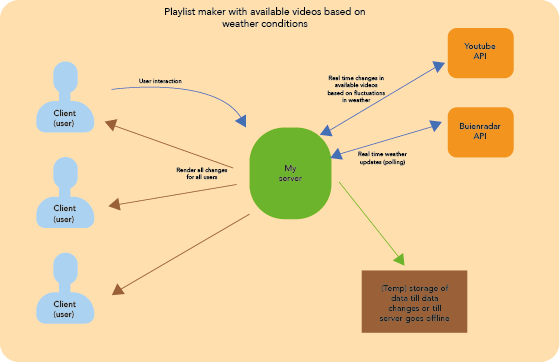

# Real-Time Web 

For this subject I will be building an app that fetches real time weather data and requests videos based on the weather conditions. The users of the app will be able to add these video's to a playlist.

For this subject I will be using the Buienradar (Weather) and the Youtube Api to collect data which i plan to make my users interact with.

### Data model
  
## Mine-chat

http://mine-chat.herokuapp.com

Socket io based real time chat application allowing you to chat with your Minecraft friends all across the world.

[Rubric][rubric]

## Curriculum

### Week 1 - Hello Server

Goal: Build and deploy a unique barebone real-time app  

[Exercises](https://github.com/cmda-minor-web/real-time-web-1819/blob/master/week-1.md)    
[Slides](https://docs.google.com/presentation/d/1EVsEFgBnG699nce058ss_PkVJROQXDp5wJJ-IRXvzTA/edit?usp=sharing)  

### Week 2 - Sharing is caring  

Goal: Store, manipulate and share data between server-client   

[Exercises](https://github.com/cmda-minor-web/real-time-web-1819/blob/master/week-2.md)    
[Slides](https://docs.google.com/presentation/d/1woKoY59D8Zcttna0FzfNjEtGtT8oXWi9b5LYlukRISM/edit?usp=sharing)

### Week 3 - Let’s take this show on the road 

Goal: Handle data sharing and multi-user support 

[Exercises](https://github.com/cmda-minor-web/real-time-web-1819/blob/master/week-3.md)  
[Slides](https://docs.google.com/presentation/d/1SHofRYg87bhdqhv7DQb_HZMbW7Iq1PtqxpdtZHMbMmk/edit?usp=sharing)

> If you're seeing this message on a forked repo, it means one of our students hasn't changed the description yet 😈

<!-- Add a link to your live demo in Github Pages 🌐-->

<!-- ☝️ replace this description with a description of your own work -->

<!-- Add a nice image here at the end of the week, showing off your shiny frontend 📸 -->

<!-- Maybe a table of contents here? 📚 -->

<!-- How about a section that describes how to install this project? 🤓 -->

<!-- ...but how does one use this project? What are its features 🤔 -->

<!-- What external data source is featured in your project and what are its properties 🌠 -->

<!-- This would be a good place for your data life cycle ♻️-->

<!-- Maybe a checklist of done stuff and stuff still on your wishlist? ✅ -->

<!-- How about a license here? 📜 (or is it a licence?) 🤷 -->

[rubric]: https://docs.google.com/spreadsheets/d/e/2PACX-1vSd1I4ma8R5mtVMyrbp6PA2qEInWiOialK9Fr2orD3afUBqOyvTg_JaQZ6-P4YGURI-eA7PoHT8TRge/pubhtml
